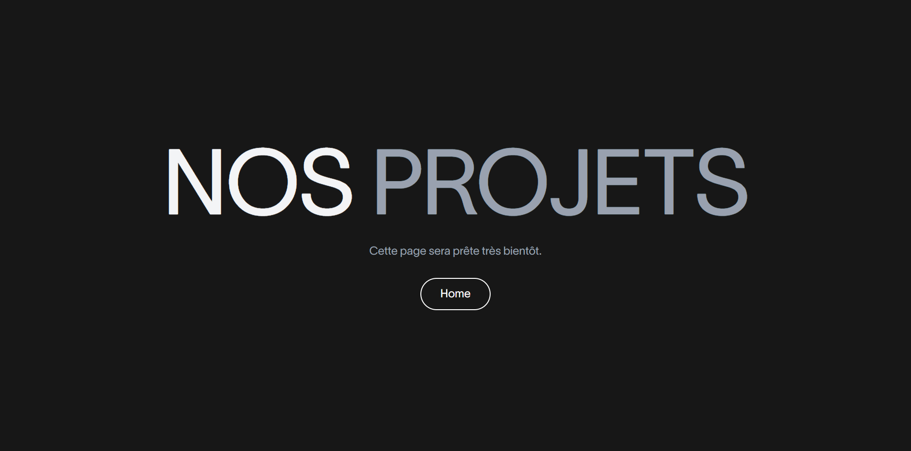

# K72

A visually engaging fitness website built using React.js, React Router, TailwindCSS, and GSAP. This project focuses on smooth animations, clean layout, and modern design elements to create an interactive and dynamic experience. Designed primarily for desktop and laptop screens, the site showcases my front-end skills with attention to animation flow, structure, and overall aesthetics rather than full mobile responsiveness.

## 🚀 Technologies Used

- React.js
- React Router 
- TailwindCSS
- GSAP

## ⚠️ This project is not Responsive

## 🌐 Live

[Click here to see live website]()

## 🖼️ Preview

